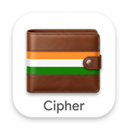

# 💳 Cipher — Intelligent Automated Expense & Credit Tracker

<div align="center">

  

  <h3>A private, beautiful, 100% offline self-custody expense & credit tracker for Bank SMS and UPI payments.</h3>

  <p>
    
    
    
  </p>
  <p>
    
    
    
  </p>

</div>

---

## 🌟 Overview

**Cipher**  is built from the ground up on **zero-trust, privacy-first, and self-custody principles**. Unlike cloud-based expense managers that upload your confidential financial messages and bank statements to remote servers, Cipher operates **100% locally on your physical device**.

> [!NOTE]
> **Network Transparency**: Cipher only uses internet connectivity to query the GitHub Releases API for **in-app updates**. Your financial data, bank SMS messages, and transaction records are **never uploaded, synced, or transmitted anywhere**.

Using high-precision regex parsing engines and a native background listener service, Cipher automatically detects debit SMS alerts, incoming UPI credits (PhonePe, GPay, Paytm, Navi, CRED), and presents an instant floating overlay to categorize your spending in seconds.

---

## ✨ Key Features

### 1. 💬 Automated Bank SMS Parser
- Parses incoming and historical bank SMS alerts using high-accuracy native regex patterns.
- Automatically extracts **Amount (₹)**, **Merchant / Beneficiary**, **Date & Time**, **Transaction Type (Debit vs Credit)**, and **Source (UPI, Savings Bank, Credit Card)**.

### 2. 🔔 Real-Time UPI Push Notification Listener
- Captures instant push notifications posted by major Indian payment apps:
  - **PhonePe** (`com.phonepe.app`)
  - **Google Pay** (`com.google.android.apps.nbu.paisa.user`)
  - **Paytm** (`net.one97.paytm`)
  - **Navi UPI** (`com.navi.passport`, `com.navi.app`)
  - **CRED** (`com.dreamplug.credpay`)
  - **BHIM**, **Slice**, **Jupiter**, **Super.money**, **MobiKwik**, **Amazon Pay**, and **Bajaj Pay**.
- Solves delayed or omitted bank SMS delivery for micro-UPI peer-to-peer payments.

### 3. ⚡ Intelligent Deduplication Engine
- Eliminates duplicate entries when **both** a Bank SMS and a UPI Push Notification trigger for the identical payment.
- Matches transaction value (±₹0.05) and debit/credit flow within a rolling 5-minute deduplication window.

### 4. 🪟 Instant System Overlay Window
- Spawns a sleek, non-intrusive floating system overlay window over current apps immediately after a transaction occurs.
- Quickly assign **Purpose / Notes** (e.g. *"Dinner with friends"*) and **Category / Beneficiary** on the fly.

### 5. 📊 Visual Analytics & Category Breakdown
- **Today's Overview**: Live summary card displaying today's spent vs incoming credit totals.
- **Interactive Donut Charts**: Powered by `fl_chart` for granular category breakdown (Food, Shopping, Bills, Transport, etc.).
- **Quick Filters & Custom Range**: Rapid toggle for **Daily**, **Monthly**, **Last Month**, and custom calendar date ranges.
- **Dedicated Month-Year Selector**: Fast monthly expense auditing without tedious day grid clicks.

### 6. 🔄 GitHub In-App Auto-Updater
- Checks the GitHub Releases API on app startup for new releases.
- Offers in-app update prompts with full changelogs and one-tap APK installation.

### 7. 🛡️ 100% On-Device Privacy & Zero Data Upload
- All parsed SMS messages, notification payloads, and logs are stored strictly inside your local SQLite database (`khata_expenses.db`).
- **Zero data upload/sync**: Cipher never uploads your financial transactions or logs to any server.
- Zero telemetry, zero analytics trackers, and zero third-party ads.

---

## 🛠️ Architecture & Tech Stack

| Component | Technology / Library |
| :--- | :--- |
| **Framework** | [Flutter](https://flutter.dev) (Dart 3.x) |
| **Local Storage** | `sqflite` (SQLite Engine), `shared_preferences` |
| **SMS Capture** | `telephony` |
| **Notification Capture** | `flutter_notification_listener` |
| **Floating Overlay** | `flutter_overlay_window` |
| **Data Visualization** | `fl_chart` |
| **AI Fallback (Optional)** | DeepSeek API (NLP message comprehension) |
| **Cloud Sync (Optional)** | Supabase Flutter SDK |

---

## 📱 Android Permissions

| Permission | Reason / Purpose |
| :--- | :--- |
| `READ_SMS` & `RECEIVE_SMS` | Required to read and parse incoming bank transaction SMS messages |
| `BIND_NOTIFICATION_LISTENER_SERVICE` | Required to capture incoming UPI credits from PhonePe, GPay, Paytm, Navi, etc. |
| `SYSTEM_ALERT_WINDOW` | Required to display the floating transaction tagging overlay over other apps |

---

## 🚀 Building & Running from Source

### Prerequisites
- [Flutter SDK](https://docs.flutter.dev/get-started/install) (>= 3.0.0)
- Android Studio / Android SDK (API 34+)
- JDK 17+

### Steps
1. **Clone the repository:**
   ```bash
   git clone https://github.com/ajay8873/cipher.git
   cd cipher
   ```

2. **Install Flutter packages:**
   ```bash
   flutter pub get
   ```

3. **Launch in Debug Mode:**
   ```bash
   flutter run -d <device_id>
   ```

4. **Build Production Release APK:**
   ```bash
   flutter build apk --release
   ```
   *The compiled APK will be located at `build/app/outputs/flutter-apk/app-release.apk`.*

---

## 🌐 Web Landing Page Deployment

A responsive web landing page is included in `web_landing/index.html`.

### Deploying to Cloudflare Pages:
1. Connect your repository to **Cloudflare Pages**.
2. Set the **Build Output Directory** to `web_landing`.
3. Set the **Build Command** to empty (or `exit 0`).
4. Deploy to access live at `https://cipher-khata.pages.dev`.

---

## 📜 License

Distributed under the **MIT License**. See [LICENSE](LICENSE) for more information.

